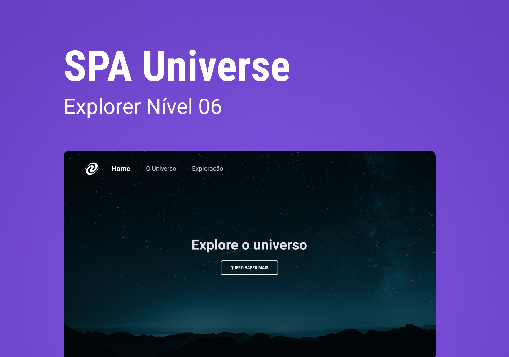

<h1 align="center"> Stage06  SPA - Universe</h1>

  <a href="#-tecnologias">Tecnologias</a>&nbsp;&nbsp;&nbsp;|&nbsp;&nbsp;&nbsp;
  <a href="#-projeto">Projeto</a>&nbsp;&nbsp;&nbsp;|&nbsp;&nbsp;&nbsp;
  <a href="#-layout">Layout</a>&nbsp;&nbsp;&nbsp;|&nbsp;&nbsp;&nbsp;
  <a href="#memo-licença">Licença</a>

  

 
  

  

## 🚀 Tecnologias

Esse projeto foi desenvolvido com as seguintes tecnologias:

- HTML 
- CSS
- Git e Github
- Figma
- Javascript

## 💻 Projeto

 Esse desafio trata-se de um projeto SPA (Single Page Application) desenvolvido para apresentar informações sobre o universo e a exploração espacial.

  <ul>
  <li>Navegação entre páginas usando links no menu de navegação</li>
  <li>Atualizando o conteúdo da página sem a necessidade de recarregar a página inteira</li>
  <li>Home: página</li>
  <li>Universe: Página com informações sobre o universo, suas características e curiosidades</li>
  <li>Exploration: página com informações sobre missões espaciais realizadas pela NASA e outras agências espaciais ao redor do mundo</li>
  <li>Transition</li>
  <li>keyframes</li>

  </ul>
      
 

- [Visite o projeto online]()

 

## 🔖 Layout

Você pode visualizar o layout do projeto através [DESSE LINK](). É necessário ter conta no [Figma](https://figma.com) para acessá-lo. 

  

## :memo: Licença

Esse projeto está sob a licença MIT.

---

Feito com ♥ by Iara Marques :wave: [Participe da comunidade da RocketSeat!](https://discord.gg/rocketseat)